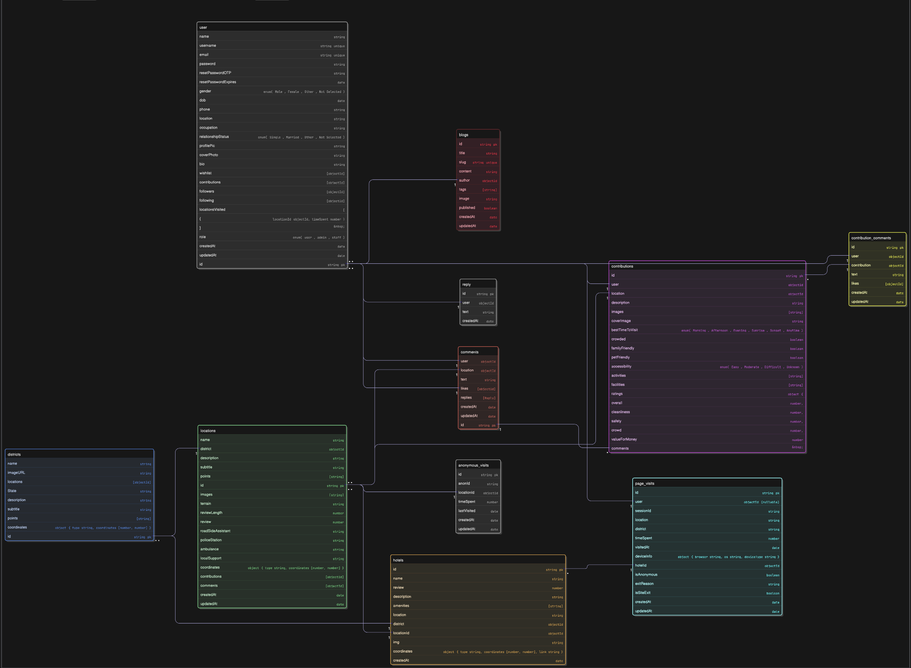

# TravelBuddy Backend Documentation

Welcome to the **TravelBuddy** backend documentation. TravelBuddy is a web application that allows users to explore destinations, hotels, and districts nearby, share contributions, post comments, and track visits. This document describes all available API endpoints, authentication requirements, and functionality.

---

## Base URL

http://http://3.108.235.83:3000/api


---
# TravelBuddy Backend - Environment Variables Example

This file provides an example of environment variables used in the TravelBuddy backend.  
Rename this file to `.env` in your local setup and replace the values with your actual credentials.

---

## MongoDB
```env
JWT_SECRET=
EMAIL_PASS=
EMAIL_USER=
BUCKET_SECRET_KEY=
BUCKET_ACCESS_KEY=
BUCKET_REGION=
BUCKET_NAME=
GOOGLE_API_KEY=
PORT=
MONGO_URI=
```
## Schema

[]

## Table of Contents

1. [Users](#users)
2. [Locations](#locations)
3. [Districts](#districts)
4. [Contributions](#contributions)
5. [Comments](#comments)
6. [Tracking](#tracking)
7. [Hotels](#hotels)
8. [Blogs](#blogs)
9. [Contact](#contact)

---


---

# TravelBuddy Backend API Documentation  
**Version:** Updated with latest schema changes  

---

## Users  
**Base route:** `/api/users`  
Handles registration, login, profile management, follow system, wishlist, visited locations, OTP reset, and admin controls.

| Endpoint | Method | Auth | Description |
|----------|---------|--------|-------------|
| /register | POST | No | Register a new user |
| /login | POST | No | Login and receive JWT |
| /profile | GET | ✔️ | Get logged-in user's profile |
| /profile | PUT | ✔️ | Update profile (profilePic, coverPhoto, gender, dob, phone, etc.) |
| /profile/:username | GET | ✔️ | Get another user's profile |
| /follow/:username | PUT | ✔️ | Follow or unfollow a user |
| /wishlist/add/:locationId | PUT | ✔️ | Add location to wishlist |
| /wishlist/remove/:locationId | PUT | ✔️ | Remove location from wishlist |
| /wishlist | GET | ✔️ | Get wishlist |
| /visited/add/:locationId | PUT | ✔️ | Add/update visited location with timeSpent |
| /visited | GET | ✔️ | Get user visited locations |
| /admin/users | GET | ✔️ Staff | Get all users |
| /admin/users/:id/role | PUT | ✔️ Staff | Update a user role |
| /admin/users/:id | DELETE | ✔️ Staff | Delete a user |
| /forgot-password | POST | No | Request OTP for password reset |
| /verify-otp | POST | No | Verify OTP |
| /reset-password | POST | No | Reset password using OTP |

---

## Districts  
**Base route:** `/api/districts`  
Manages districts, points, coordinates, images, and linked locations.

| Endpoint | Method | Auth | Description |
|----------|---------|--------|-------------|
| / | GET | No | Get all districts |
| /:id | GET | No | Get district by ID |
| /state/:state | GET | No | Get districts by state |
| /:id/comments | GET | No | Get comments for district |
| /nearest/:lat/:lon | GET | No | Get nearest district |
| / | POST | ✔️ Admin | Create district |
| /:id/location | PUT | ✔️ Admin | Add location to district |
| /:id | PUT | ✔️ Admin | Update district |
| /:id | DELETE | ✔️ Admin | Delete district |

---

## Locations  
**Base route:** `/api/locations`  
Handles creation, updates, mapping to districts, safety info, services, terrain, GPS coordinates, contributions.

| Endpoint | Method | Auth | Description |
|----------|---------|--------|-------------|
| / | GET | No | Get all locations |
| /district/:district | GET | No | Get locations by district |
| /:id | GET | No | Get location by ID |
| /nearest/:lat/:lon | GET | No | Get nearest location |
| / | POST | ✔️ Staff | Create location (multiple images) |
| /:id | PUT | ✔️ Staff | Update location info |
| /:id | DELETE | ✔️ Staff | Delete location |

---

## Hotels  
**Base route:** `/api/hotels`  
Updated with coordinates object, district reference, and amenities array.

| Endpoint | Method | Auth | Description |
|----------|---------|--------|-------------|
| / | GET | No | Get all hotels |
| /:id | GET | No | Get hotel details |
| /nearest/:locationId | GET | No | Get nearby hotels for a location |
| / | POST | ✔️ Staff | Create hotel |
| /:id | PUT | ✔️ Staff | Update hotel |
| /:id | DELETE | ✔️ Staff | Delete hotel |

---

## Contributions  
**Base route:** `/api/contributions`  

| Endpoint | Method | Auth | Description |
|----------|---------|--------|-------------|
| / | POST | ✔️ | Create contribution |
| /user | GET | ✔️ | Get user's contributions |
| /location/:locationId | GET | No | Get contributions for location |
| /district/:id | GET | No | Get contributions for district |
| /:id | GET | No | Get single contribution |
| /verify/:id | PUT | ✔️ Staff | Verify contribution |
| /:id/like | PUT | ✔️ | Like/unlike |
| /:id/comments | GET | No | Get comments for contribution |
| /:id/comments | POST | ✔️ | Add comment to contribution |
| / | GET | ✔️ Staff | Get all contributions |
| /:id | DELETE | ✔️ Staff | Delete contribution |
| /contribId/comments/like/:commentId | PUT | ✔️ | Like/unlike a comment |

---

## Comments  
**Base route:** `/api/comments`  
Supports replies, nested comments, and moderation.

| Endpoint | Method | Auth | Description |
|----------|---------|--------|-------------|
| / | POST | ✔️ | Add comment |
| /location/:locationId | GET | No | Get comments for location |
| /district/:districtId | GET | No | Get comments for district |
| /like/:id | PUT | ✔️ | Like/unlike comment |
| /reply/:id | POST | ✔️ | Add reply |
| /reply/:commentId/:replyId | DELETE | ✔️ | Delete reply |
| / | GET | ✔️ Staff | Get all comments |
| /:id | DELETE | ✔️ Staff | Delete comment |

---

## Tracking  
**Base route:** `/api/track`  
Handles analytics, anonymous visits, and page interactions.

| Endpoint | Method | Auth | Description |
|----------|---------|--------|-------------|
| / | POST | No | Track visit |
| /exit | POST | No | Record exit event |
| /stats | GET | No | Full analytics overview |
| /user-stats | GET | No | Stats for logged-in user |
| /user-details/:userId | GET | No | Detailed user analytics |
| /location-stats | GET | No | All location analytics |
| /location-details/:locationId | GET | No | Single location analytics |
| /hotel-stats | GET | No | All hotel analytics |
| /hotel-details/:hotelId | GET | No | Single hotel analytics |
| /top-hotels | GET | No | Top visited hotels |

---

## Blogs  
**Base route:** `/api/blogs`

| Endpoint | Method | Auth | Description |
|----------|---------|--------|-------------|
| / | GET | No | Get all blogs |
| /:slug | GET | No | Get blog by slug |
| / | POST | ✔️ Staff | Create blog |
| /:id | PUT | ✔️ Staff | Update blog |
| /:id | DELETE | ✔️ Staff | Delete blog |

---

## Contact  
**Base route:** `/api/contact`

| Endpoint | Method | Auth | Description |
|----------|---------|--------|-------------|
| / | POST | No | Send contact message |
| /send-otp | POST | No | Send OTP |
| /verify-otp | POST | No | Verify OTP |

---

## Authentication Notes  
- Uses **JWT (Bearer Token)**  
- `protect` middleware required for user routes  
- `staffProtect` and `adminProtect` used for restricted routes  
- Tracking routes allow **anonymous access**  

---

## File Uploads

- All image uploads use **Multer memory storage** for in-memory processing.
- Multiple images supported for locations and contributions (`maxCount: 10`).
- Single images for district, hotels, and blogs.

---

## Notes

- Track endpoints can handle anonymous users.
- Contributions and comments can be liked/unliked.
- Users can follow/unfollow each other.
- Wishlist allows adding/removing favorite locations.
- Location search supports nearest coordinates queries.

---

**TravelBuddy Backend** is designed to support a fully-featured travel exploration app with rich user-generated content, analytics, and admin moderation capabilities.
